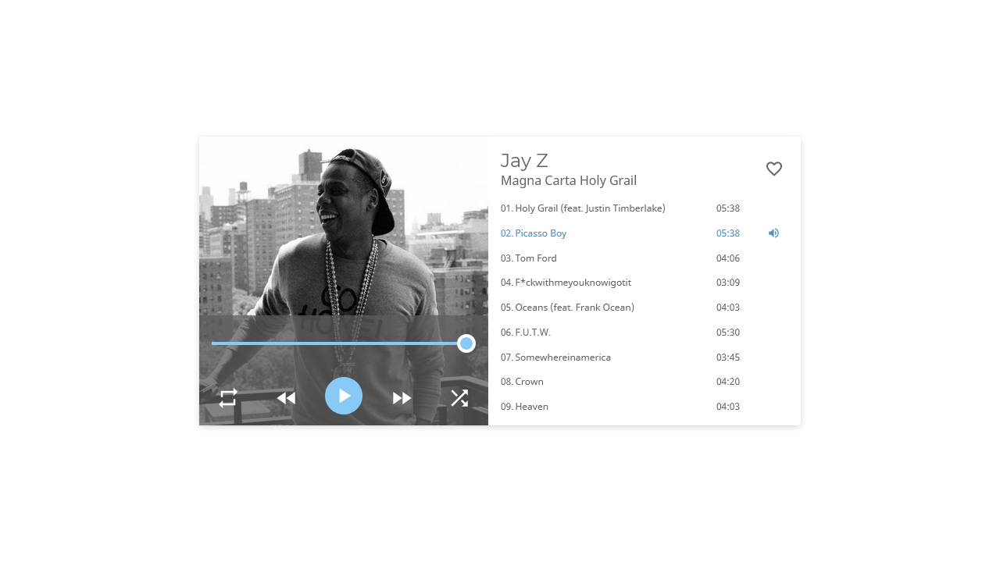

# Music Player

## Ejercicio

Maquetar el siguiente diseño https://xd.adobe.com/view/2b600ad6-e1aa-437a-a929-719dc26a8087-7e33/ con HTML y CSS. Las imagenes, e iconos, podes descargarlas del enlace en el icono de </>.

Importante: No hay ninguna restricción para el uso de herramientas, utilidades o frameworks, tampoco se necesita que sea funcional, ni que esté terminado con todos los detalles. Una vez terminado subí un zip con tu solución.

## Screenshot

## Tecnologias

- HTML
- CSS

## Live Demo

- [Link](https://eloquent-brown-60e42e.netlify.app/)
